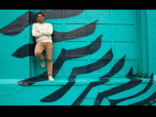
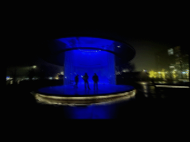
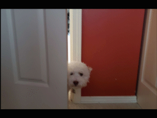
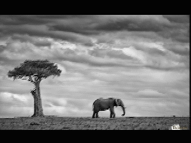
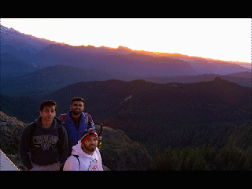

# Seam Carving
Implementation of the seam carving algorithm for content-aware image resizing.

Shout out to Avik Das' explanation of the algorithm [here.](https://avikdas.com/2019/05/14/real-world-dynamic-programming-seam-carving.html)

# Vertical Seam Removal
Some source images turned out better than others. The quality of the output is also dependent on how many iterations we put the photos through. Objects and edges in photos are more likely to become skewed as we identify and remove larger number of seams. In the following photos, we only removed vertical seams of pixels (shrinking the images horizontally).

## Wall (good)

## Stage (warping in later iterations)

## Dog (extensive warping)

# Bidirectional Seam Removal Examples
 Here we shrink images both horizontally and vertically to maintain aspect ratio. 
### Elephant

### Ranier

In both cases, you can see that the output frames tend to center in on the key elements of the photos. In the first example, we see removal of pixels on the edges as well as in the middle (between the tree and elephant). In the second example, we see removal of pixels in the top and right of the image and preservation of the people in the bottom left corner.

# Next steps
~~I currently only implemented vertical seam carving (shrinking the image horizontally). I want to implement vertical shrinking as well.~~

~~Being able to resize images vertically and horizontally opens up the ability to scale images down proportionally,
rather than always skewing the dimensions of the source file.~~

One possibility would be to build this into a web service, giving me the opportunity to work on RESTful API development in Java using [Spring](https://spring.io/).